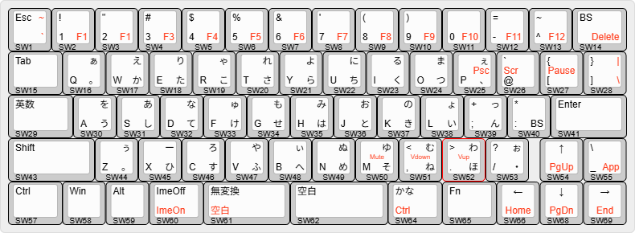
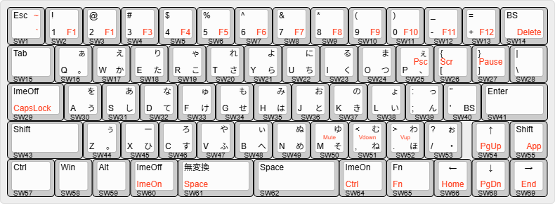

# nkc70_release

このリポジトリは、`nkc70` キーボードの KiCad 8 ハードウェア設計データを管理するためのものです。

## nkc70キーボードについて
`nkc70` キーボードは ロープロファイルなキーボードスイッチの代表格である、Kailh Choc V1スイッチを用いた、hoboNicolaキーボードです。以下のような特長があります。

- 親指シフトキーボードに準じた配列とし、親指キー同時打鍵による入力ができる。
- 1Uサイズとして18 x 17mmの最小ピッチを採用。
- 一般的な60%キーボードから1列減らすことで、横幅を20mmほど縮小。
- スイッチプレート、PCB、ボトムプレートの3枚のFR-4プレートと、5mm厚のアクリル板によるサポートで構成。
- 厚さは、プレート部分が約10mm、その上のスイッチとキーキャップが約8mmで、合計18mmほど。
- マイコンはRP2040を採用。スイッチマトリックスは、5 x 14 (70ポジション) 。 

## レイアウト
このプロジェクトでは、以下のようなレイアウトのhoboNicolaキーボードを実現することを前提としています。

### 日本語レイアウトで使うとき

### USレイアウトで使うとき

### レイアウトについて
- 赤字で示したレジェンドは、Fnキーを押下中の場合の出力を示しています。
- 図中の ImeOn、ImeOffという表記はHID LANG0, LANG1相当のコードを表しています。
- 無変換、変換、かなといった表記は、Windowsでのキーです。
- 無変換キーは、MacOSでは無効。ただ、UbuntuなどのLinux環境ではANSIレイアウトであってもIME操作に利用できるようです。
- ハードウェアキーボードとして英語キーボードレイアウト / ANSIレイアウトとして使うときはUSレイアウトとします。
- USレイアウトのCapsLockがFn側になっているのは、CapsLockキーでIMEを英字に切り替えたいときにはCapsLockがオンにならないようにするための配慮です。

### 構造と組立て
FR-4プレートとアクリルサポートにより、以下のような構造になります。

組立てには、M2サイズの皿ネジとM2サイズの真鍮スペーサー(female-female, 8mm長)を用います。

## 各ディレクトリの内容

- `layout/`
  - KLEで作成したキー配列定義データです。
  - 日本語配列用の `nkc70_rev22.json` と、US配列用の `nkc70_rev22_us.json` を含みます。

- `pcb/`
  - メイン PCB の設計データです。
  - 1.6mm厚のFR-4プレートで作ることを前提としています。
    - 回路図（`*.kicad_sch`）と配線図/基板レイアウト（`*.kicad_pcb`）、プロジェクト内ライブラリ（`lib/`）を含みます。
  - `lib/nklib.kicad_sym` には、回路図で使っているいくつかのシンボル定義を含んでいます。回路ででは、`local` というニックネームで修飾しています。
  - `lib` ディレクトリには、このPCBで使っているいくつかのデバイスのフットプリントを含んでいます。
  - `lib/kiswitch` ディレクトリには、githubのkiswitchリポジトリからダウンロードした、Choc V1スイッチのいくつかのフットプリントを含んでいます。

- `swplate/`
  - スイッチプレート用の設計データです。
  - 1.2mm厚のFR-4プレートで作ることが必須です。
  - メインPCBのPCB図を基に、スイッチ用フットプリントをスイッチをはめるためのEdge.Cutsで描いた矩形のみのフットプリント (`ChocV1_hole138.kicad_mod') に置き換えて生成しています。
  - 2Uおよび2.25Uのスイッチのフットプリントについては、スタビライザー用のカットアウトをもつフットプリントに置き換えています。
  - ネジ穴が他のプレートからずれないようにしながら、外形サイズをPCBより大きくしています。

- `bplate/`
  - ボトムプレート（底板）用の設計データです。
  - 1.6mm厚のFR-4プレートで作ることを前提としています。
  - 

- `acrylic/`
  - PCBとボトムプレート間に配置するアクリルサポート用の設計データおよびカット用ファイルを含みます。
  - アクリルカット用の外形データの設計データをもつPCB図。2D CADとして利用。
  - `dxf` および `pdf` ファイル。設計データからプロットした出力ファイルを含んでいます。
  - アクリルサポートの外形、ネジ穴位置はPCBや他のプレートと密接に関係しています。`pcb` ディレクトリにあるPCB図にUser.4で描いている外形が基になっています。

